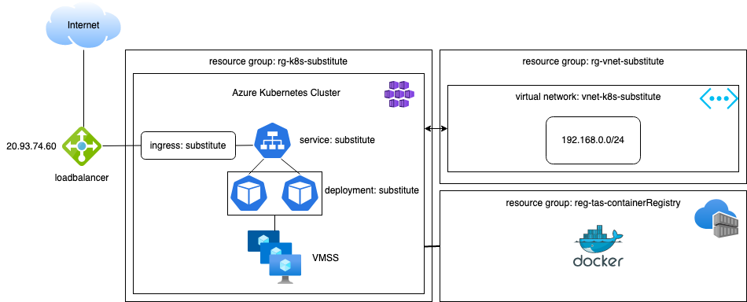

# substitute-golang
Golang API that adds © to certain words, e.g. to Amazon, Google, Microsoft.

For the infrastructure creation on Azure, Bicep was used. Within Bicep Resource groups, Virtual networks, Azure Kubernetes are created and the Azure Kubernetes is attached to the Azure Container Registry.

After the Azure infrastructure was created the kubernetes Nginx ingress controller is created through Helm charts and YAMLs.
The kubernetes Deployment uses the Golang substitute image from the ACR, exposes it on 8080 through the service and is eventually be picked up through the ingress by the Nginx ingress controller.

A diagram of the architecture is shown below:

